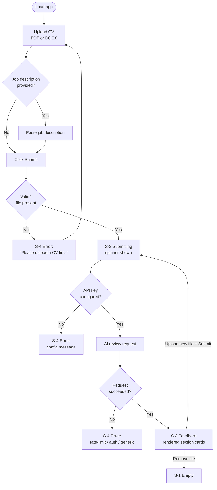
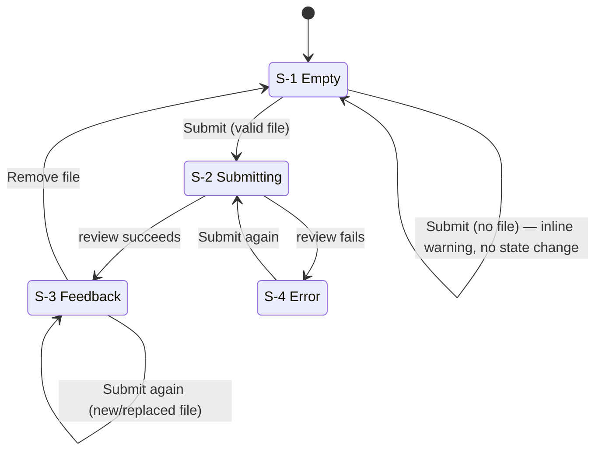

# Functional Specification Document (FSD)

**Project:** RedPen — AI-Powered CV Reviewer
**Author:** Huzaifa Najam
**Status:** Active
**Related documents:** [BRD](BRD.md), [TSD](TSD.md)

---

## 1. Purpose

This document translates the business requirements in the [BRD](BRD.md) into concrete functional
behavior: what the system does, screen by screen and rule by rule, from the user's point of view.
It defines *what* RedPen must do, independent of *how* it is built — implementation details
(languages, libraries, hosting, prompt internals) belong in the [TSD](TSD.md).

## 2. Actors

| Actor | Description |
|-------|-------------|
| User | A job seeker who uploads a CV and, optionally, a job description, and receives structured feedback. There is no authentication, no roles, and no distinction between user types. |
| AI reviewer (system) | The system's own review engine (currently backed by Google Gemini — see [TSD](TSD.md)). Not a human-facing actor; included here because its behavior is functionally specified in §6. |

## 3. Functional Overview

RedPen is a single-page, single-session flow: a user uploads exactly one CV, optionally provides
a job description, submits, and receives a structured review in place. There is no multi-step
wizard, no account, and no persisted state beyond the current browser session.

If the user uploads a new file or removes the current one, the flow resets to the upload step.
Submitting again at any point re-runs the full flow and replaces whatever feedback was showing.

## 4. Screens and States

RedPen has a single screen with two columns (left: input, right: output) and no navigation. The
right-hand output area has four possible states:

<table>
<colgroup><col style="width:10%"><col style="width:90%"></colgroup>
<thead><tr><th>ID</th><th>State</th></tr></thead>
<tbody>
<tr><td style="white-space:nowrap">S-1</td><td><b>Empty</b> — default state on load, and whenever no file is uploaded or feedback has been cleared. Shows a placeholder prompting the user to upload a CV and click Submit.</td></tr>
<tr><td style="white-space:nowrap">S-2</td><td><b>Submitting</b> — shown immediately after Submit is clicked and inputs are valid. Displays a spinner with the message "Reviewing your CV — this takes a few seconds..."</td></tr>
<tr><td style="white-space:nowrap">S-3</td><td><b>Feedback</b> — the AI review has returned successfully and is rendered as a sequence of color-coded cards, one per section (see §6).</td></tr>
<tr><td style="white-space:nowrap">S-4</td><td><b>Error</b> — validation failed or the review request failed. An inline message is shown in place of the spinner; the Empty or previous Feedback state remains in the output area (an error does not clear prior feedback).</td></tr>
</tbody>
</table>

## 5. Functional Requirements

Each requirement below maps to the [BRD](BRD.md)'s business requirements (traceability in §9).

### 5.1 Input

<table>
<colgroup><col style="width:10%"><col style="width:90%"></colgroup>
<thead><tr><th>ID</th><th>Requirement</th></tr></thead>
<tbody>
<tr><td style="white-space:nowrap">FR-1</td><td>The system shall accept exactly one uploaded file per review, in PDF or DOCX format only. Any other file type shall be rejected by the file picker itself.</td></tr>
<tr><td style="white-space:nowrap">FR-2</td><td>The system shall reject uploaded files larger than 10MB.</td></tr>
<tr><td style="white-space:nowrap">FR-3</td><td>The system shall provide an optional free-text field for a job description, with no minimum or maximum length enforced.</td></tr>
<tr><td style="white-space:nowrap">FR-4</td><td>The system shall allow the user to remove an uploaded file, at which point the output area returns to the Empty state (S-1) if feedback was showing.</td></tr>
<tr><td style="white-space:nowrap">FR-5</td><td>The system shall allow the user to replace an uploaded file without reloading the page; a subsequent Submit shall review the new file only.</td></tr>
</tbody>
</table>

### 5.2 Submission and validation

<table>
<colgroup><col style="width:10%"><col style="width:90%"></colgroup>
<thead><tr><th>ID</th><th>Requirement</th></tr></thead>
<tbody>
<tr><td style="white-space:nowrap">FR-6</td><td>If Submit is clicked with no file uploaded, the system shall show the message "Please upload a CV first." and shall not make a review request.</td></tr>
<tr><td style="white-space:nowrap">FR-7</td><td>If no job description is provided, the system shall run in CV-only mode (§6.1). If a non-empty job description is provided, the system shall run in CV+JD mode (§6.2).</td></tr>
<tr><td style="white-space:nowrap">FR-8</td><td>On a valid Submit, the system shall transition immediately to the Submitting state (S-2) before the review completes.</td></tr>
</tbody>
</table>

### 5.3 Review generation

<table>
<colgroup><col style="width:10%"><col style="width:90%"></colgroup>
<thead><tr><th>ID</th><th>Requirement</th></tr></thead>
<tbody>
<tr><td style="white-space:nowrap">FR-9</td><td>For a PDF CV, the system shall process the document as submitted (visually), so that content is captured correctly even when the source is a design-tool export where text is rendered as vector paths rather than extractable characters.</td></tr>
<tr><td style="white-space:nowrap">FR-10</td><td>For a DOCX CV, the system shall extract all text content, including text located in text boxes and shapes, not only body paragraphs.</td></tr>
<tr><td style="white-space:nowrap">FR-11</td><td>If a DOCX file yields no extractable text, the system shall show an error and shall not proceed to a review request.</td></tr>
<tr><td style="white-space:nowrap">FR-12</td><td>The system shall not reject or degrade a review because the CV contains more than one language; it shall only note a language mix as an issue if it genuinely impairs clarity.</td></tr>
</tbody>
</table>

### 5.4 Output

<table>
<colgroup><col style="width:10%"><col style="width:90%"></colgroup>
<thead><tr><th>ID</th><th>Requirement</th></tr></thead>
<tbody>
<tr><td style="white-space:nowrap">FR-13</td><td>The system shall render a successful review as a fixed, ordered sequence of visually distinct sections (see §6), each addressing the user directly ("you"/"your") rather than referring to them in the third person.</td></tr>
<tr><td style="white-space:nowrap">FR-14</td><td>Every "Problem"/"Missing"-type item in the output shall be paired with a concrete "Fix" — a specific rewrite or action, not generic advice.</td></tr>
<tr><td style="white-space:nowrap">FR-15</td><td>A new successful review shall fully replace any feedback currently displayed; no partial or stale content from a prior review shall remain visible.</td></tr>
<tr><td style="white-space:nowrap">FR-16</td><td>The system shall display a data-handling notice (that the CV is sent to a third-party AI provider and is not stored) at all times, not only on submission.</td></tr>
</tbody>
</table>

### 5.5 Error handling

<table>
<colgroup><col style="width:10%"><col style="width:90%"></colgroup>
<thead><tr><th>ID</th><th>Requirement</th></tr></thead>
<tbody>
<tr><td style="white-space:nowrap">FR-17</td><td>If the system is not configured with a valid API credential, the system shall show a configuration-specific error ("GEMINI_API_KEY not found...") rather than attempting the request or showing a generic failure.</td></tr>
<tr><td style="white-space:nowrap">FR-18</td><td>If the review request fails due to rate limiting, the system shall show a message indicating high traffic and suggesting a retry in about a minute.</td></tr>
<tr><td style="white-space:nowrap">FR-19</td><td>If the review request fails due to an authentication or permission error, the system shall show a generic apology message rather than exposing internal error detail.</td></tr>
<tr><td style="white-space:nowrap">FR-20</td><td>For any other failure, the system shall show a generic retry message rather than an unhandled error or a blank state.</td></tr>
</tbody>
</table>

## 6. Feedback Structure Specification

### 6.1 CV-only mode (no job description supplied)

Triggered when the job description field is empty. Output shall consist of exactly these
sections, in this order:

<table>
<colgroup><col style="width:22%"><col style="width:78%"></colgroup>
<thead><tr><th>Section</th><th>Content rule</th></tr></thead>
<tbody>
<tr><td>Overall Impression</td><td>2–3 sentences, the candid first impression a recruiter would form in ~10 seconds.</td></tr>
<tr><td>Strengths</td><td>Bulleted list; each item names what works and why, referencing actual CV content.</td></tr>
<tr><td>Areas for Improvement</td><td>Exactly 3 numbered items, each with a Problem (specific, content-referenced) and a Fix (concrete rewrite/action).</td></tr>
<tr><td>Quick Win</td><td>A single highest-impact change, stated directly.</td></tr>
</tbody>
</table>

Total response length target: under 450 words.

### 6.2 CV + Job Description mode

Triggered when a non-empty job description is supplied. Output shall consist of exactly these
sections, in this order:

<table>
<colgroup><col style="width:22%"><col style="width:78%"></colgroup>
<thead><tr><th>Section</th><th>Content rule</th></tr></thead>
<tbody>
<tr><td>Overall Impression</td><td>2–3 sentences on the candidate's profile and immediate impression for this specific role.</td></tr>
<tr><td>Strengths</td><td>Bulleted list; each item ties CV content to something the target role values.</td></tr>
<tr><td>Job Fit</td><td>2–3 sentences on overall alignment and whether the candidate would likely clear an initial screen.</td></tr>
<tr><td>Gaps</td><td>Exactly 3 numbered items, each with a Missing (what the role needs that the CV doesn't show) and a Fix.</td></tr>
<tr><td>Areas for Improvement</td><td>Exactly 2 numbered items — general CV quality issues unrelated to the specific role.</td></tr>
<tr><td>Quick Win</td><td>The single change with the most impact on this candidate's chances for this specific role.</td></tr>
</tbody>
</table>

Total response length target: under 600 words.

### 6.3 Presentation

Each section is rendered as an individually color-coded card (distinct background/accent color
per section identity — e.g., Strengths in green, Gaps in red) so a user can visually scan review
sections without reading every word. An unrecognized section (should the output ever deviate from
the fixed structure) shall still render, using a neutral default color, rather than being dropped.

## 7. Non-Functional Requirements (functional-level)

<table>
<colgroup><col style="width:10%"><col style="width:90%"></colgroup>
<thead><tr><th>ID</th><th>Requirement</th></tr></thead>
<tbody>
<tr><td style="white-space:nowrap">NFR-1</td><td>A review shall typically complete in under 10 seconds from Submit to rendered feedback (observed range in testing: ~4–9 seconds; see <a href="../TESTING.md">TESTING.md</a>).</td></tr>
<tr><td style="white-space:nowrap">NFR-2</td><td>The application shall require no user registration, login, or persisted account state.</td></tr>
<tr><td style="white-space:nowrap">NFR-3</td><td>The application shall be usable on both desktop and mobile-width viewports; below a defined breakpoint, the input column shall stop floating alongside the output column.</td></tr>
</tbody>
</table>

## 8. Out of Scope (functional level)

- Editing, downloading, or exporting the CV itself.
- Saving or retrieving past reviews.
- Comparing multiple CVs or multiple job descriptions in one session.
- Any feedback language/tone other than direct, second-person English output.

## 9. Traceability to BRD

<table>
<colgroup><col style="width:16%"><col style="width:84%"></colgroup>
<thead><tr><th>BRD requirement</th><th>Satisfied by</th></tr></thead>
<tbody>
<tr><td>BR-1</td><td>NFR-2 (no account required)</td></tr>
<tr><td>BR-2</td><td>FR-1</td></tr>
<tr><td>BR-3</td><td>FR-13, FR-14, §6 content rules</td></tr>
<tr><td>BR-4</td><td>FR-7, §6.2</td></tr>
<tr><td>BR-5</td><td>NFR-1</td></tr>
<tr><td>BR-6</td><td>FR-12</td></tr>
<tr><td>BR-7</td><td>§6, FR-13</td></tr>
<tr><td>BR-8</td><td>FR-16</td></tr>
<tr><td>BR-9</td><td>See <a href="../TESTING.md">TESTING.md</a> and <a href="../regression-tests/README.md">regression-tests/</a> (out of scope for this document)</td></tr>
</tbody>
</table>

## 10. Glossary

See [BRD §11](BRD.md#11-glossary). Additional terms:

| Term | Definition |
|------|-----------|
| Section card | The individually styled, color-coded block used to render one section of feedback (e.g., "Strengths"). |
| CV-only mode | Review mode used when no job description is supplied (§6.1). |
| CV+JD mode | Review mode used when a job description is supplied (§6.2). |
