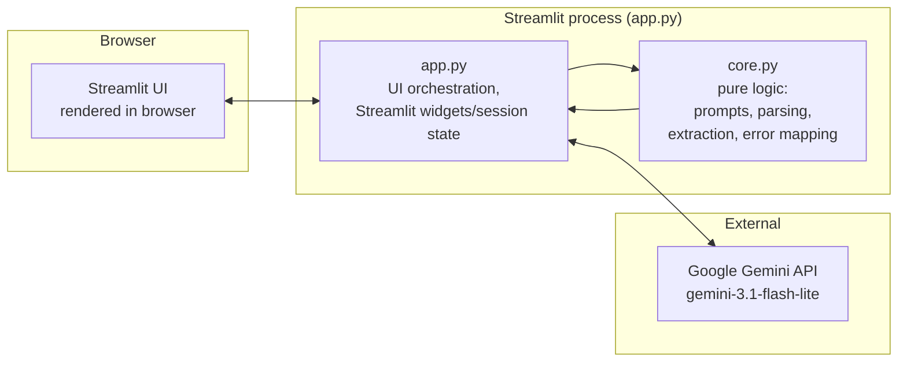
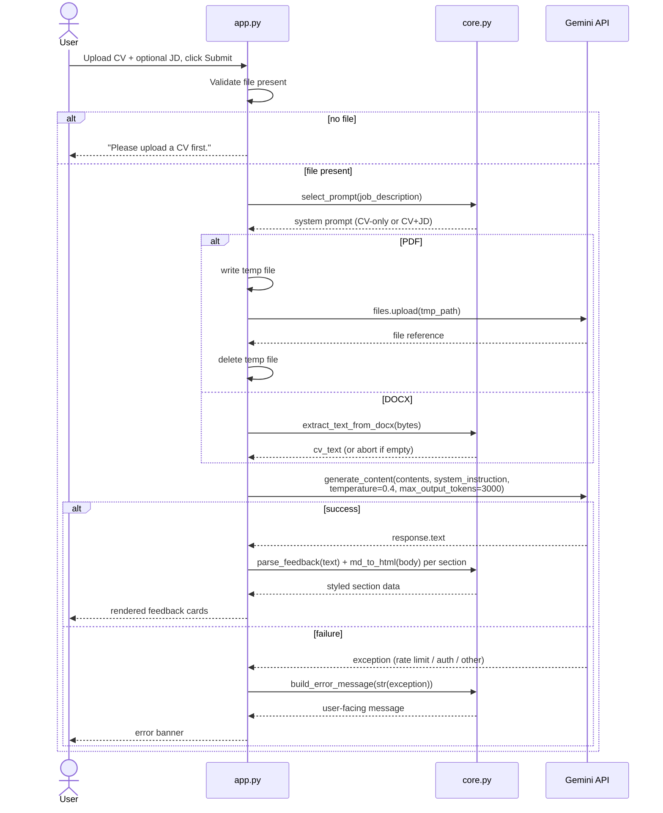
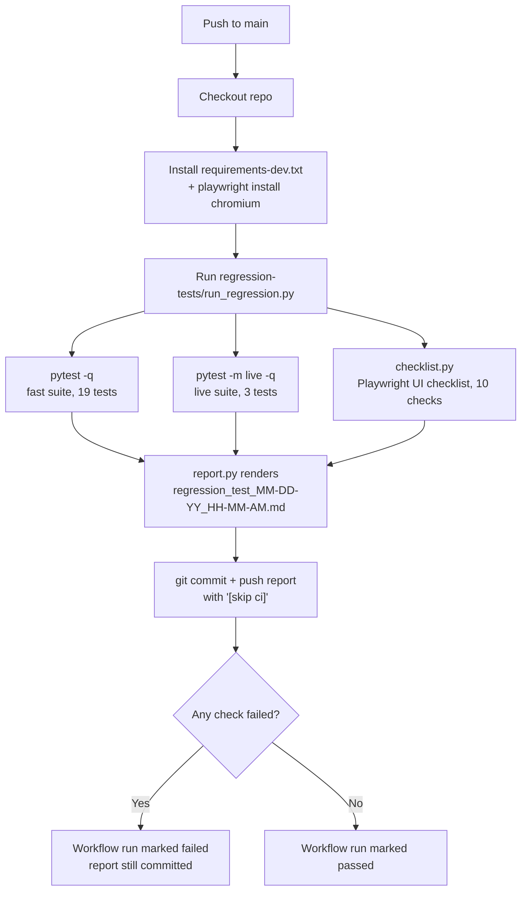

# Technical Specification Document (TSD)

**Project:** RedPen — AI-Powered CV Reviewer
**Author:** Huzaifa Najam
**Status:** Active
**Related documents:** [BRD](BRD.md), [FSD](FSD.md)

---

## 1. Purpose

This document specifies *how* RedPen is built: architecture, technology choices, module
responsibilities, data flow, external dependencies, and operational concerns. It implements the
behavior defined in the [FSD](FSD.md), which in turn satisfies the business requirements in the
[BRD](BRD.md). Where the FSD describes what the system does, this document describes the code and
infrastructure that make it do it.

## 2. System Architecture

RedPen is a single-process, stateless web application with no database and no backend server of
its own — Streamlit is the server. There are three tiers: the browser (Streamlit's client-rendered
UI), the Streamlit process (UI + business logic, in the same Python process), and the external
Gemini API.

Deliberately absent: no database, no message queue, no caching layer, no auth service. State is
held entirely in Streamlit's per-session `st.session_state` and lost on refresh — consistent with
BRD's BR-1 (no accounts) and the out-of-scope exclusion of saved history.

## 3. Technology Stack

<table>
<colgroup><col style="width:22%"><col style="width:78%"></colgroup>
<thead><tr><th>Layer</th><th>Choice</th></tr></thead>
<tbody>
<tr><td>UI / application server</td><td>Streamlit (Python) — chosen for zero-boilerplate UI and built-in deployment to Streamlit Community Cloud.</td></tr>
<tr><td>AI model</td><td>Google Gemini 3.1 Flash Lite, via the <code>google-genai</code> SDK.</td></tr>
<tr><td>Document parsing</td><td><code>python-docx</code> (raw XML traversal) for DOCX; native PDF vision input for PDF (no separate OCR/text-extraction library — see §5.1).</td></tr>
<tr><td>Hosting</td><td>Streamlit Community Cloud, auto-deploying from <code>main</code> on every push (independent of the CI pipeline in §8).</td></tr>
<tr><td>Testing</td><td>pytest (fast + live suites), Playwright (headless-Chromium UI checklist). See <a href="../TESTING.md">TESTING.md</a>.</td></tr>
<tr><td>CI</td><td>GitHub Actions, triggered on push to <code>main</code>.</td></tr>
</tbody>
</table>

## 4. Module Breakdown

<table>
<colgroup><col style="width:16%"><col style="width:84%"></colgroup>
<thead><tr><th>Module</th><th>Responsibility</th></tr></thead>
<tbody>
<tr><td><code>app.py</code></td><td>All Streamlit-coupled code: page config, CSS, widget layout, session-state management, the Gemini API call itself (<code>review_cv</code>), and rendering feedback into styled HTML cards. Deliberately thin — delegates every piece of logic that doesn't need <code>st.*</code> to <code>core.py</code>.</td></tr>
<tr><td><code>core.py</code></td><td>Pure, framework-free logic: the two system prompts (<code>PROMPT_CV_ONLY</code>, <code>PROMPT_CV_WITH_JD</code>), <code>SECTION_CONFIG</code> (section → color mapping), <code>select_prompt</code>, <code>md_to_html</code>, <code>parse_feedback</code>, <code>extract_text_from_docx</code>, <code>build_error_message</code>. No Streamlit import, no network calls — this is what makes the fast test suite possible without mocking.</td></tr>
<tr><td><code>tests/test_core.py</code></td><td>19 unit tests against <code>core.py</code>, no network.</td></tr>
<tr><td><code>tests/test_prompts_live.py</code></td><td>3 tests against the real Gemini API, marked <code>@pytest.mark.live</code>, verifying the prompt/output structural contract.</td></tr>
<tr><td><code>regression-tests/</code></td><td>CI orchestration: <code>run_regression.py</code> (entrypoint), <code>checklist.py</code> (Playwright-driven UI checks), <code>report.py</code> (Markdown report generation). See §8.</td></tr>
</tbody>
</table>

## 5. Core Data Flow

### 5.1 Document ingestion (format-dependent branch)

PDF and DOCX are handled by fundamentally different mechanisms, not a shared "extract text" step:

- **PDF** is never text-extracted locally. The raw bytes are written to a temporary file
  (`tempfile.NamedTemporaryFile`), uploaded to Gemini via `client.files.upload()`, and passed to
  `generate_content` as a file reference. Gemini reads the PDF visually, which is why layouts that
  break traditional text extraction (e.g., Canva exports with text-as-vector-paths) still work.
  The temp file is deleted (`os.unlink`) immediately after upload, in a `finally` block.
- **DOCX** is text-extracted locally via `core.extract_text_from_docx`, which walks the document's
  raw XML (`doc.element.body.iter(f"{{{W}}}t")`) rather than using `python-docx`'s paragraph API —
  this catches text inside text boxes and shapes that the paragraph-only API misses. If extraction
  yields no text, the request is aborted before any API call (`st.error` + `st.stop()`).

### 5.2 Request/response sequence

## 6. External Dependency: Gemini API

<table>
<colgroup><col style="width:22%"><col style="width:78%"></colgroup>
<thead><tr><th>Parameter</th><th>Value</th></tr></thead>
<tbody>
<tr><td>Model</td><td><code>gemini-3.1-flash-lite</code></td></tr>
<tr><td>Temperature</td><td>0.4</td></tr>
<tr><td>Max output tokens</td><td>3000</td></tr>
<tr><td>SDK</td><td><code>google-genai</code>, via <code>genai.Client(api_key=...)</code></td></tr>
<tr><td>Endpoints used</td><td><code>client.files.upload</code> (PDF path only), <code>client.models.generate_content</code></td></tr>
<tr><td>Authentication</td><td>API key read from <code>st.secrets["GEMINI_API_KEY"]</code> at request time; never hardcoded, never logged.</td></tr>
</tbody>
</table>

The model/temperature/token-limit combination is a swappable implementation detail, not a
contract — the [FSD](FSD.md) defines behavior (section structure, word counts, tone) independent
of which model produces it, which is why `tests/test_prompts_live.py` asserts on structure, not
exact wording.

## 7. Configuration and Secrets

<table>
<colgroup><col style="width:26%"><col style="width:74%"></colgroup>
<thead><tr><th>File</th><th>Purpose</th></tr></thead>
<tbody>
<tr><td><code>.streamlit/config.toml</code></td><td>App-level server config. Currently sets <code>maxUploadSize = 10</code> (MB), enforced by Streamlit's uploader itself — see FR-2.</td></tr>
<tr><td><code>.streamlit/secrets.toml</code></td><td>Local-only, git-ignored. Holds <code>GEMINI_API_KEY</code>. On Streamlit Community Cloud, the equivalent is set via the app's Secrets panel, not this file.</td></tr>
<tr><td><code>GEMINI_API_KEY</code> (GitHub Actions secret)</td><td>Injected as an environment variable into the CI job; <code>regression-tests/checklist.py</code> writes it into an ephemeral <code>secrets.toml</code> on the runner (never committed) so the live app can be driven end-to-end.</td></tr>
</tbody>
</table>

## 8. CI Pipeline

`.github/workflows/regression.yml` runs on every push to `main` (see [regression-tests/README.md](../regression-tests/README.md) for the full rationale, including why it's scoped to `main` only).

`checklist.py` runs two ephemeral `streamlit run app.py` server instances on the runner (ports
8600 and 8601): one with a working key for the main checks, one with the key name deliberately
broken to exercise the missing-key error path (FR-17 / M8) — both are torn down at the end of the
run regardless of outcome.

## 9. Deployment

Two independent, decoupled deployment mechanisms watch the same `main` branch:

- **GitHub Actions** (`regression.yml`) — runs tests, produces evidence, does *not* deploy anything.
- **Streamlit Community Cloud** — watches `main` via its own git integration and auto-redeploys
  `app.py` on every push, regardless of whether the CI job passed or failed.

This means a red CI run does not block deployment — see the BRD/FSD discussion for the tradeoff;
closing that gap (deploy gated on CI success) would require moving off Streamlit Community Cloud's
built-in auto-deploy or calling its API explicitly as a post-test CI step.

## 10. Error Handling Implementation

`core.build_error_message` maps caught exception text to a user-facing string (FR-17–FR-20):

<table>
<colgroup><col style="width:34%"><col style="width:66%"></colgroup>
<thead><tr><th>Condition (substring match on exception text)</th><th>User-facing message</th></tr></thead>
<tbody>
<tr><td><code>"429"</code> or <code>"resource_exhausted"</code> (case-insensitive)</td><td>"RedPen is getting a lot of traffic right now. Please try again in a minute."</td></tr>
<tr><td><code>"401"</code>, <code>"403"</code>, <code>"unauthenticated"</code>, or <code>"permission"</code></td><td>"Something went wrong on our end. Please try again shortly."</td></tr>
<tr><td>Anything else</td><td>"Something went wrong. Please try again."</td></tr>
</tbody>
</table>

The missing-API-key case (FR-17) is handled separately and earlier, before any request is made:
`app.py` checks `st.secrets.get("GEMINI_API_KEY", "")` and short-circuits with a distinct
configuration-error message if empty.

## 11. Testing Architecture

Summarized here; full detail in [TESTING.md](../TESTING.md) and [regression-tests/README.md](../regression-tests/README.md).

- **Fast suite** (`tests/test_core.py`, 19 tests) — pure-function tests against `core.py`, no
  network, run by default (`pytest.ini` excludes `live`-marked tests via `addopts`).
- **Live suite** (`tests/test_prompts_live.py`, 3 tests) — real Gemini calls, asserts on the
  prompt/output structural contract (headers, order, word-count ceiling), not exact wording.
- **UI checklist** (`regression-tests/checklist.py`, 10 checks) — headless-Chromium Playwright
  driving the actual running app, end to end, with no mocking at any layer.

## 12. Known Technical Constraints

- Streamlit Community Cloud's free tier has limited compute and no autoscaling — concurrent-user
  behavior under load is untested and not a current design target (BRD explicitly scopes RedPen as
  a single-developer, portfolio-scale project).
- Gemini's free-tier rate limits are shared across all users of the deployed app (single API key);
  the 429 handling in §10 is the only mitigation.
- No retry/backoff logic beyond what `google-genai`'s SDK does internally (via `tenacity`) — a
  failed request surfaces to the user rather than being silently retried by application code.
- `st.session_state` is per-browser-session; there is no server-side persistence, so a page refresh
  during "Submitting" loses in-flight state (consistent with BR-1's no-accounts requirement, but
  worth noting as a UX tradeoff).

## 13. Traceability to FSD

<table>
<colgroup><col style="width:16%"><col style="width:84%"></colgroup>
<thead><tr><th>FSD requirement</th><th>Implemented by</th></tr></thead>
<tbody>
<tr><td>FR-1, FR-2</td><td><code>.streamlit/config.toml</code> (§7), Streamlit's native file-type/size validation on the uploader widget</td></tr>
<tr><td>FR-6</td><td><code>app.py</code>'s <code>if not uploaded_file</code> check before any review call</td></tr>
<tr><td>FR-7</td><td><code>core.select_prompt</code></td></tr>
<tr><td>FR-9, FR-10, FR-11</td><td><code>app.py</code>'s PDF branch (§5.1) and <code>core.extract_text_from_docx</code></td></tr>
<tr><td>FR-12</td><td>Prompt rule in <code>PROMPT_CV_ONLY</code> / <code>PROMPT_CV_WITH_JD</code> (§6)</td></tr>
<tr><td>FR-13–FR-15</td><td><code>core.parse_feedback</code>, <code>core.md_to_html</code>, <code>app.py</code>'s <code>render_feedback</code></td></tr>
<tr><td>FR-17–FR-20</td><td>§10 of this document</td></tr>
<tr><td>NFR-1</td><td>Model choice (Gemini Flash Lite) and <code>max_output_tokens=3000</code> cap (§6)</td></tr>
</tbody>
</table>
